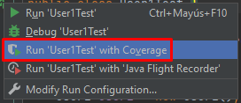

# **Testing Con JUnit en IntelliJ IDEA**

# **Kata Simple Para Afianzar la Metodología TDD**

Registro centralizado en la arquitectura de microservicios utilizando ELK(Elasticsearch-Logstash-Kibana) + Spring Boot Microservice

## **Requisito Tener IntelliJ IDEA**

- __[IntelliJ IDEA](https://www.jetbrains.com/es-es/idea/download/#section=windows)__

## **Archivos `.java`**

- Crear una clase llamada `User2.java`, y crear un campo string llamado name.

- Crear una clase llamada `User1.java`, con los siguientes métodos:
    * Arraylist
    * crear
    * buscar
    * borrar

- Crear una clase llamada `User1Test.java`, en la misma ubicación, ejemplo:
    * main -> java -> com -> testingjunit -> user -> `User1.java`
    * test -> java -> com -> testingjunit -> user -> `User1Test.java`

- En la clase `User1Test.java`, crear los siguientes métodos anotados:
    * inicializar
    * testCrearUser
    * testObtenerUser
    * testObtenerUserNoExistente
    * testBorrarUser
    * testBorrarUserNoExistente

-->

- Ejecutar la clase `User1Test.java` with Coverage.

- En la parte inferior se visualizará los resultados de los Test.

- Se puede visualizar los resultados por cada Test.

- Podemos ver el coverage de la clase `User1.java`.

